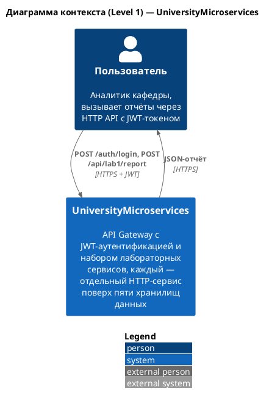
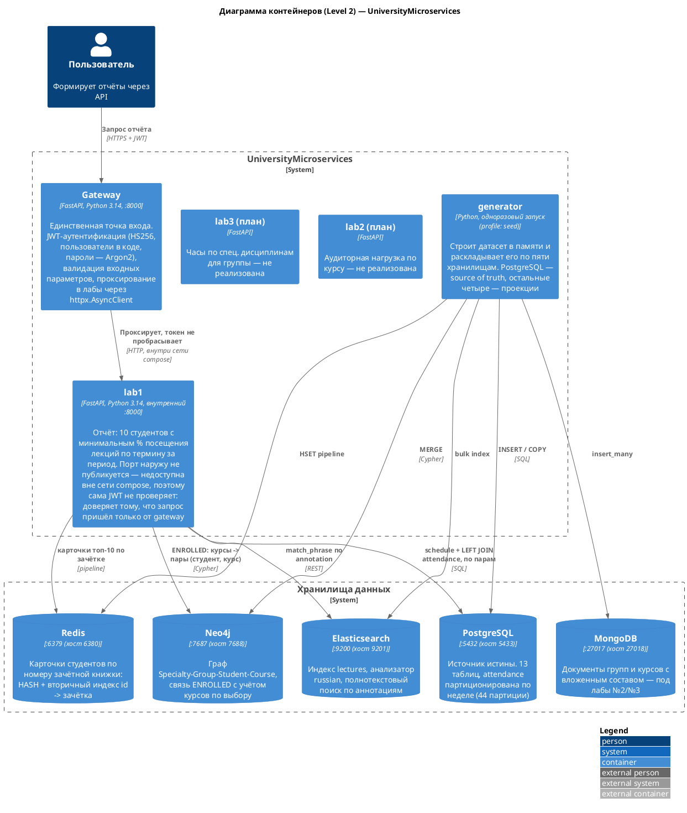
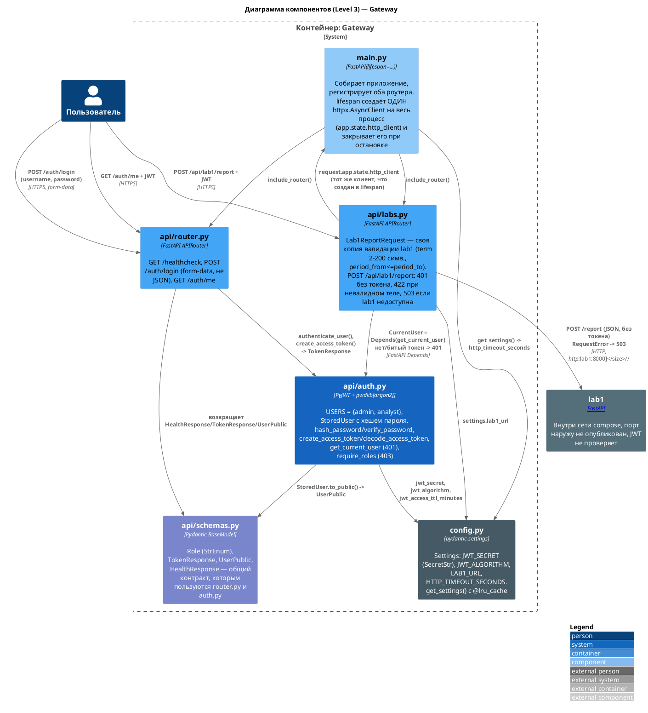
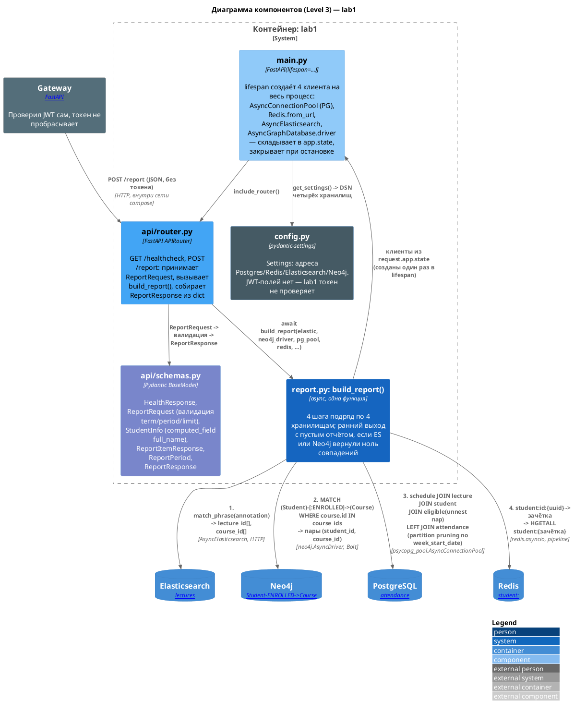
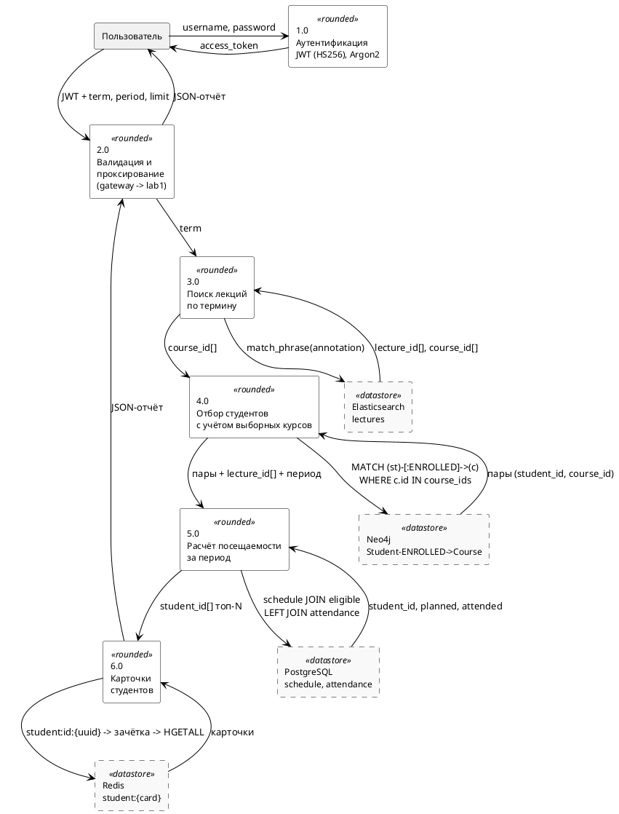

# Диаграммы архитектуры

Нотации: **C4** (Context, Container, Component) — PlantUML + библиотека
C4-PlantUML (`!include <C4/...>`), и **DFD** в нотации Йордана–Коуда
(Level 0, Level 1) — PlantUML `rectangle`.

Рендер: [plantuml.com/plantuml](https://www.plantuml.com/plantuml/uml/) или
локально `plantuml` с `-tsvg`. Диаграммы отражают то, что реально реализовано
и проверено в коде: gateway + лаба №1. Лабы №2 и №3 отмечены на диаграмме
контейнеров как запланированные — они лягут в ту же архитектуру, но ещё не
написаны.

---

## C4 — Level 1: Context

---

## C4 — Level 2: Container

---

## C4 — Level 3: Component

Разворачиваем gateway и lab1 — единственные два контейнера с реализованной
логикой.

Компоненты gateway (аутентификация и проксирование) и компоненты lab1
(оркестрация четырёх хранилищ) — двумя отдельными диаграммами, каждая
разворачивает свой контейнер по-файлово: один компонент = один файл с
одной ответственностью. Слоя Repository/адаптеров нет ни там, ни там —
оркестраторы (`labs.py`, `report.py`) обращаются к клиентам хранилищ
напрямую, без прослойки; так решили осознанно, для четырёх-пяти вызовов
подряд отдельный класс на каждое хранилище был бы лишней абстракцией.

### Gateway

### lab1

---

## DFD — Level 0 (контекстная диаграмма)

```plantuml
@startuml DFD_Level0
skinparam rectangle {
    BorderColor #000000
    FontSize 14
}
skinparam rectangle<<rounded>> {
    BorderColor #000000
    BackgroundColor #FFFFFF
    FontSize 14
    BorderRadius 15
}
skinparam arrow {
    Color #000000
    FontSize 12
}

rectangle "Пользователь" as User
rectangle "UniversityMicroservices" as System

User -right-> System : JWT-токен, параметры отчёта
System -left-> User : JSON-отчёт

@enduml
```

---

## DFD — Level 1 (декомпозиция: путь запроса лабы №1)

Показывает ровно то, что делает `build_report()` — четыре хранилища подряд,
с реальными потоками данных между ними.

### Обоснование потоков (для отчёта)

| Шаг | Хранилище | Почему именно оно |
|---|---|---|
| 3.0 | Elasticsearch | обратный индекс с анализатором `russian` находит термин в любой словоформе; в PostgreSQL тот же поиск был бы перебором по `ILIKE` без индекса |
| 4.0 | Neo4j | среди совпавших курсов есть выборные — обход `ENROLLED` даёт **пары** (студент, курс), а не плоский список: иначе студент, записанный на один совпавший курс, получил бы в отчёт занятия и другого совпавшего курса, который не выбирал (проверено на реальных данных: 131 студент без фильтра против 124 фактически записанных на пяти выборных курсах) |
| 5.0 | PostgreSQL | единственное хранилище, где есть факт посещения (`is_present`); `attendance` партиционирована по неделе — фильтр по `week_start_date` читает только недели периода, а не всю таблицу |
| 6.0 | Redis | карточка студента по номеру зачётной книжки за O(1); в PostgreSQL это был бы дополнительный `JOIN` к `student`, `student_group`, `specialty` на каждой строке отчёта |
