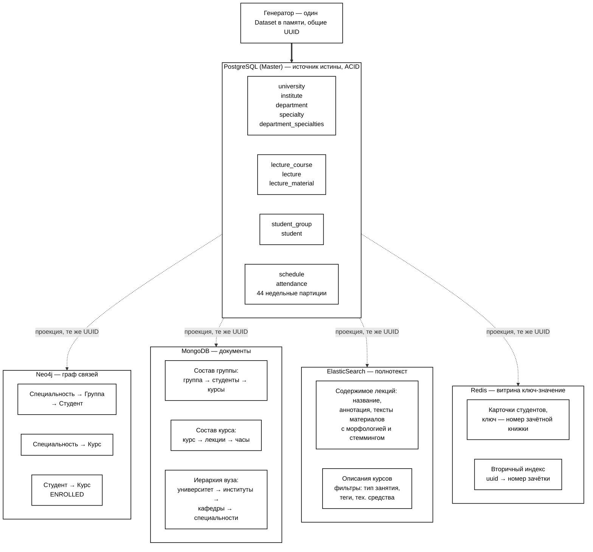

# Схема 2 — размещение данных по хранилищам

## Принцип

`task.md:42` требует «разместить информацию по различным видам представления
хранения данных ... для обеспечения оптимальной структуры для выборки
информации в целях аналитических запросов». То есть хранилища делятся не по
сущностям, а по **способу доступа**: каждое держит ту форму данных, которую
умеет отдавать быстрее остальных.

**PostgreSQL — единственный источник истины.** Остальные четыре держат
денормализованные проекции тех же сущностей. Все пять используют одни и те же
UUID: идентификаторы присваиваются один раз в `generator/app/data.py`, поэтому
запись в любом хранилище сопоставляется с записью в другом без перекодировки.

CDC нет. Генератор собирает `Dataset` в памяти и синхронно записывает его
во все пять хранилищ. Потеря любой проекции не критична — повторный запуск
генератора восстанавливает её из того же набора данных.

## Что где лежит и почему

| Хранилище | Вид представления | Что держит | Почему именно здесь |
|---|---|---|---|
| **PostgreSQL** | транзакционные данные с партиционированием | 12 таблиц: организация, учебный план, студенты, расписание, посещаемость | единственное место, где есть `is_present`; `attendance` партиционирована по `week_start_date`, поэтому фильтр по периоду читает только нужные недели |
| **Redis** | структура ключ-значение | `student:{зачётка}` → HASH с карточкой; `student:id:{uuid}` → вторичный индекс; `students` → SET номеров | `task.md:30`: ключ — номер зачётной книжки. Карточка достаётся за одно обращение по ключу, без поиска |
| **MongoDB** | объекты документ-композиция | `groups` — группа со вложенными студентами и курсами; `courses` — курс со вложенными лекциями; `university` — иерархия вуза одним документом | `task.md:32`: «документ с данными и составом группы». Полная информация о группе читается одним `findOne` вместо пяти JOIN |
| **Neo4j** | наборы типизированных связей | узлы `Specialty`, `Group`, `Student`, `Course`; связи `HAS_GROUP`, `HAS_STUDENT`, `OFFERS`, `ENROLLED` | `task.md:34`: «связи между группой-студентом-курсом». Обход связи вместо многоуровневого JOIN |
| **Elasticsearch** | полнотекстовая информация с метаданными | индекс `lectures` — аннотация и склеенные тексты материалов, анализатор `russian`; индекс `courses` — описания | `task.md:36`: «данные с полнотекстовым описанием курса». В PostgreSQL тот же поиск был бы `ILIKE` без индекса и без учёта русской морфологии |

Факты посещения лежат **только** в PostgreSQL. В Neo4j их нет сознательно:
их десятки тысяч и они растут каждую неделю — место такому объёму
в партиционированной таблице, а не в графе.

## Маршрут лабораторной работы №1

Отчёт о 10 студентах с минимальным процентом посещения собирается
последовательным проходом по четырём хранилищам:

1. **Elasticsearch** — по термину или фразе находит лекции. Поиск идёт по
   `annotation` и `content_text` (склеенные тексты материалов занятия),
   фильтр `lecture_type = лекция` отсекает практики и лабораторные.
   Возвращает id лекций и id курсов.
2. **Neo4j** — по id курсов обходит `ENROLLED` и отдаёт пары
   (студент, курс). Пара, а не плоский список: иначе отчёт спутал бы
   разные совпавшие курсы одного студента.
3. **PostgreSQL** — считает посещаемость по этим парам за период. Фильтр по
   `week_start_date` бьёт в ключ партиционирования. Запрос чисто
   аналитический: возвращает идентификаторы и числа, без полей карточки.
4. **Redis** — по десяти идентификаторам отдаёт карточки: `MGET` по
   вторичному индексу переводит UUID в номера зачёток, затем пайплайн
   `HGETALL`. Два round-trip на весь отчёт. При промахе карточка
   дочитывается из PostgreSQL.

MongoDB в лабе №1 не участвует: отчёт не читает ни состав группы,
ни иерархию вуза. Её очередь — в лабах №2 и №3.

## Mermaid — в компоновке Схемы 2 из отчёта

