# DFD (нотация Йордана-Коуда), Level 1 — UniversityMicroservices

ЛР1 отражена по коду (`lab1/app/report.py`) один в один. ЛР2 и ЛР3 в коде
ещё не реализованы (нет каталогов `lab2/`, `lab3/`), поэтому их процессы —
проектное решение по `task.md` и раскладке хранилищ из `generator/app/db/*`:
ЛР2 использует документ курса в MongoDB (уже содержит вложенные лекции с
`computer_type`) и обход Neo4j для подсчёта реальных слушателей с учётом
выборных курсов; ЛР3 — GIN-индекс по `lecture.tags` в PostgreSQL для тега
спецдисциплины и документ группы в MongoDB для итоговой композиции. Когда
лабы будут написаны — сверить этот блок с реализацией и поправить при
расхождении.

```plantuml
@startuml DFD_Level1
skinparam rectangle {
    BorderColor #000000
    FontSize 12
}
skinparam rectangle<<rounded>> {
    BorderColor #000000
    BackgroundColor #FFFFFF
    FontSize 12
    BorderRadius 15
}
skinparam rectangle<<datastore>> {
    BorderStyle dashed
    BackgroundColor #F9F9F9
    BorderColor #000000
}
skinparam arrow {
    Color #000000
}

rectangle "Пользователь" as User

rectangle "1.0\nАутентификация\nOAuth2 Password Flow (PyJWT)" as Auth
rectangle "2.0\nВалидация запроса\nи проксирование\n(gateway: httpx.AsyncClient)" as Proxy

rectangle "3.1\nЛР1: Посещаемость\nпо термину в аннотации\n(ES→Neo4j→PG→Redis)" as Report1
rectangle "3.2\nЛР2: Требуемая аудитория\nпо курсу/семестру\n(Mongo→Neo4j)" as Report2
rectangle "3.3\nЛР3: Часы спец.дисциплин\nпо группе\n(PG→Neo4j→PG→Mongo)" as Report3

rectangle "PostgreSQL" as PG <<datastore>>
rectangle "Redis" as Redis <<datastore>>
rectangle "Neo4j" as Neo4j <<datastore>>
rectangle "Elasticsearch" as ES <<datastore>>
rectangle "MongoDB" as Mongo <<datastore>>

User -down-> Auth : POST /auth/login\n{username, password}
Auth -up-> User : access_token (JWT)

User -down-> Proxy : POST /api/lab{1,2,3}/report\nBearer JWT + {term|course|group, ...}
Proxy -up-> User : JSON-отчёт

Proxy -down-> Report1 : term, period_from, period_to, limit
Proxy -down-> Report2 : course_id, semester, year, computer_type
Proxy -down-> Report3 : group_id

' --- ЛР1: студенты с минимальным % посещения по термину (реализовано) ---
Report1 -down-> ES : match_phrase по annotation
ES -up-> Report1 : lecture_id, course_id (по совпавшим лекциям)
Report1 -down-> Neo4j : MATCH (:Student)-[:ENROLLED]->(:Course)\nWHERE c.id IN course_ids
Neo4j -up-> Report1 : пары (student_id, course_id)
Report1 -down-> PG : JOIN schedule×lecture×attendance\nпо парам, партиции week_start_date
PG -up-> Report1 : lectures_planned, lectures_attended
Report1 -down-> Redis : GET student:id:{id} →\nHGETALL student:{card}, pipeline
Redis -up-> Report1 : карточка студента

' --- ЛР2: аудитория и число слушателей курса (проектное решение) ---
Report2 -down-> Mongo : courses.find(semester, "lectures.computer_type")
Mongo -up-> Report2 : курс + вложенные лекции (полная инфо)
Report2 -down-> Neo4j : (:Group {enrollment_year: year})-[:HAS_STUDENT]->\n(:Student)-[:ENROLLED]->(:Course {id})
Neo4j -up-> Report2 : count(Student) — число слушателей\n(с учётом выборных)

' --- ЛР3: часы спецдисциплин по группе (проектное решение) ---
Report3 -down-> PG : SELECT id FROM lecture\nWHERE tags @> ARRAY[тег] -- GIN-индекс
PG -up-> Report3 : lecture_id спецдисциплин
Report3 -down-> Neo4j : (:Group {id})-[:HAS_STUDENT]->(:Student)-[:ENROLLED]->(:Course)
Neo4j -up-> Report3 : пары (student_id, course_id) внутри группы
Report3 -down-> PG : часы = count(schedule)×2 -- план\nsum(attendance.is_present)×2 -- факт,\nтолько по lecture_id спецдисциплин
PG -up-> Report3 : запланированные/посещённые часы на студента
Report3 -down-> Mongo : groups.findOne(group_id)
Mongo -up-> Report3 : полная информация о группе и студентах

@enduml
```

