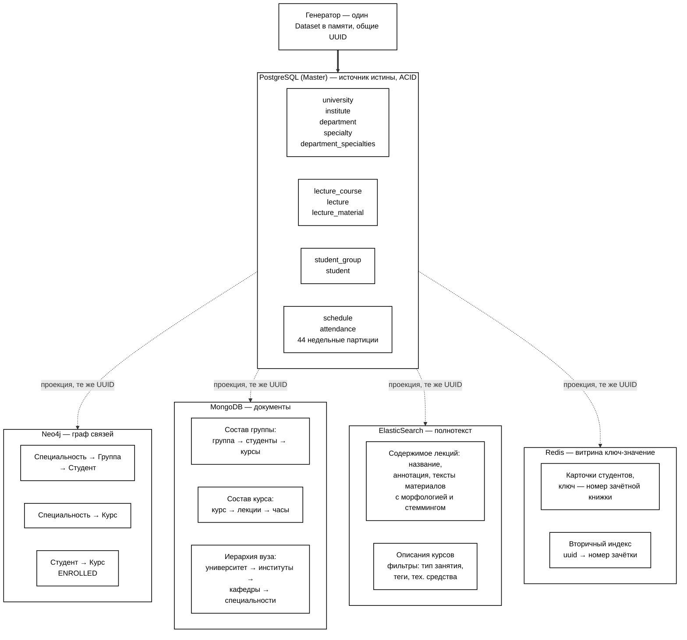

# Исходники схем к отчёту

Код обеих схем из `практика3_Сытенков_ПАПО_новые_схемы.pdf`.
Соответствует DDL из `generator/app/db/postgres.py` и адаптерам
`generator/app/db/*.py` на ветке `feature/lab1-redis`.

Как отрисовать:

| Схема | Сервис | Что делать |
|---|---|---|
| 1 — ER-диаграмма | [dbdiagram.io](https://dbdiagram.io) | вставить блок DBML целиком, Export → PNG |
| 2 — размещение данных | [mermaid.live](https://mermaid.live) | вставить блок Mermaid, Actions → PNG, фон белый |

Mermaid открывается и в draw.io: **Arrange → Insert → Advanced → Mermaid**,
если захочется подвигать блоки мышью.

---

## Схема 1 — ER-диаграмма PostgreSQL

12 таблиц, 13 связей. PostgreSQL — источник истины; остальные четыре
хранилища описаны Note-блоками в конце (dbdiagram показывает их
как заметки на полотне).

```dbml
Project UniversityMicroservices {
  database_type: 'PostgreSQL'
  Note: '''
    PostgreSQL — источник истины (source of truth), 12 таблиц. Остальные
    четыре хранилища (Redis, MongoDB, Neo4j, Elasticsearch) держат
    денормализованные проекции этих же сущностей и НЕ являются реляционными
    по своей природе — их структура описана в Note-блоках ниже, а не
    таблицами DBML, чтобы не рисовать несуществующие FK. Все пять хранилищ
    используют одни и те же UUID (присваиваются один раз в
    generator/app/data.py), поэтому записи легко сопоставить между базами.

    updated_at обновляется триггером set_updated_at() на каждой таблице:
    DEFAULT срабатывает только на INSERT.
  '''
}

// ======================== ОРГАНИЗАЦИОННАЯ СТРУКТУРА ========================

Table university {
  id uuid [pk]
  name varchar(500) [not null]
  short_name varchar(100)
  address text
  website varchar(255)
  founded_year int
  created_at timestamp [default: `now()`]
  updated_at timestamp [default: `now()`]
}

Table institute {
  id uuid [pk]
  university_id uuid [not null, ref: > university.id, note: 'ON DELETE CASCADE']
  name varchar(500) [not null]
  short_name varchar(100)
  dean varchar(300)
  created_at timestamp [default: `now()`]
  updated_at timestamp [default: `now()`]
}

Table department {
  id uuid [pk]
  institute_id uuid [not null, ref: > institute.id, note: 'ON DELETE CASCADE']
  name varchar(500) [not null]
  short_name varchar(100)
  head varchar(300)
  room varchar(50)
  created_at timestamp [default: `now()`]
  updated_at timestamp [default: `now()`]
}

Table specialty {
  id uuid [pk]
  name varchar(500) [not null]
  code varchar(20) [not null, unique]
  degree_level varchar(20)
  duration_years int
  created_at timestamp [default: `now()`]
  updated_at timestamp [default: `now()`]
}

Table department_specialties {
  id uuid [pk]
  department_id uuid [not null, ref: > department.id, note: 'ON DELETE CASCADE']
  specialty_id uuid [not null, ref: > specialty.id, note: 'ON DELETE CASCADE']
  is_primary boolean [default: true, note: 'кафедра выпускающая по этой специальности']
  created_at timestamp [default: `now()`]
  updated_at timestamp [default: `now()`]
  Note: 'M:N кафедра — специальность'

  indexes {
    (department_id, specialty_id) [unique]
  }
}

// ============================= УЧЕБНЫЙ ПЛАН =============================

Table lecture_course {
  id uuid [pk]
  specialty_id uuid [not null, ref: > specialty.id, note: 'ON DELETE CASCADE']
  name varchar(500) [not null]
  description text
  semester int [note: 'CHECK IN (1, 2)']
  total_hours int
  lecture_hours int
  practice_hours int
  lab_hours int
  created_at timestamp [default: `now()`]
  updated_at timestamp [default: `now()`]

  indexes {
    (semester, specialty_id)
  }
}

Table lecture {
  id uuid [pk]
  course_id uuid [not null, ref: > lecture_course.id, note: 'ON DELETE CASCADE']
  title varchar(500) [not null]
  annotation text [note: 'здесь лаба №1 ищет термин или фразу']
  lecture_type varchar(50) [note: 'лекция / практика / лабораторная; лаба №1 считает процент только по лекциям']
  computer_type varchar(100) [note: 'требования к тех. средствам — лаба №2']
  tags "text[]" [note: 'GIN; тег «специальная дисциплина кафедры» — лаба №3']
  order_number int
  duration_minutes int [default: 90]
  created_at timestamp [default: `now()`]
  updated_at timestamp [default: `now()`]

  indexes {
    course_id
    tags [type: gin]
  }
}

Table lecture_material {
  id uuid [pk]
  lecture_id uuid [not null, ref: > lecture.id, note: 'ON DELETE CASCADE']
  content_type varchar(50)
  title varchar(500)
  content_text text
  file_url varchar(1000)
  metadata jsonb
  created_at timestamp [default: `now()`]
  updated_at timestamp [default: `now()`]
}

// ============================== СТУДЕНТЫ ==============================

Table student_group {
  id uuid [pk]
  specialty_id uuid [not null, ref: > specialty.id, note: 'ON DELETE CASCADE']
  name varchar(50) [not null, unique]
  enrollment_year int
  curator varchar(300)
  created_at timestamp [default: `now()`]
  updated_at timestamp [default: `now()`]

  indexes {
    specialty_id
  }
}

Table student {
  id uuid [pk]
  group_id uuid [not null, ref: > student_group.id, note: 'ON DELETE CASCADE']
  first_name varchar(100) [not null]
  last_name varchar(100) [not null]
  patronymic varchar(100)
  email varchar(255) [unique]
  phone varchar(20)
  student_card_number varchar(20) [unique, note: 'ключ карточки в Redis']
  enrollment_date date
  status varchar(20) [default: 'active']
  created_at timestamp [default: `now()`]
  updated_at timestamp [default: `now()`]

  indexes {
    group_id
  }
}

// ======================= РАСПИСАНИЕ И ПОСЕЩАЕМОСТЬ =======================

Table schedule {
  id uuid [pk]
  lecture_id uuid [not null, ref: > lecture.id, note: 'ON DELETE CASCADE']
  group_id uuid [not null, ref: > student_group.id, note: 'ON DELETE CASCADE']
  scheduled_date date [not null]
  week_start_date date [not null]
  start_time time
  end_time time
  classroom varchar(50)
  teacher_name varchar(300)
  status varchar(20) [default: 'scheduled']
  created_at timestamp [default: `now()`]
  updated_at timestamp [default: `now()`]

  indexes {
    (lecture_id, week_start_date)
    group_id
    scheduled_date
  }
}

Table attendance {
  id uuid [not null]
  week_start_date date [not null]
  schedule_id uuid [not null, ref: > schedule.id, note: 'ON DELETE CASCADE']
  student_id uuid [not null, ref: > student.id, note: 'ON DELETE CASCADE']
  is_present boolean [not null, default: true]
  marked_at timestamp [default: `now()`]
  marked_by varchar(300) [note: 'преподаватель, который вёл занятие']
  note varchar(500)
  created_at timestamp [default: `now()`]
  updated_at timestamp [default: `now()`]
  Note: 'PARTITION BY RANGE (week_start_date) — 44 недельные партиции на учебный год. Ключ партиционирования входит в PK: глобальных индексов в PostgreSQL нет.'

  indexes {
    (id, week_start_date) [pk]
    (schedule_id, student_id, week_start_date) [unique]
    (student_id, week_start_date)
    schedule_id
  }
}

// ======================= ДЕНОРМАЛИЗОВАННЫЕ ПРОЕКЦИИ =======================
// Не реляционные хранилища: показаны как Note, а не Table, т.к. в них нет
// схемы/FK в понимании PostgreSQL. Идентификаторы совпадают с id выше.

Note redis_projection {
  '''
  Redis — только карточки студентов, ключ = номер зачётки (task.md).

  student:{card_number}      HASH    id, card_number, last_name, first_name,
                                      patronymic, full_name, email, phone,
                                      status, enrollment_date, group_id,
                                      group_name, specialty_id, specialty_name,
                                      specialty_code
  student:id:{student.id}    STRING  вторичный индекс: uuid -> card_number
  students                   SET     все card_number

  Источник: student ⋈ student_group ⋈ specialty.
  '''
}

Note mongo_projection {
  '''
  MongoDB — документы-композиции (task.md: «документ с данными и составом
  группы»), БД university.

  groups (_id = student_group.id)
    name, enrollment_year, curator,
    specialty: { id, name, code, degree_level, duration_years },
    students: [ { id, card_number, full_name, email, phone, status, ... } ],
    students_count,
    courses: [ { id, name, semester, lecture_hours } ]

  courses (_id = lecture_course.id)
    name, description, semester,
    hours: { total, lecture, practice, lab },
    specialty: { id, name, code, degree_level, duration_years },
    lectures: [ { id, title, order_number, computer_type, tags,
                  duration_minutes } ],
    lectures_count

  university (_id = university.id) — иерархия вуза одним документом
    name, short_name, address, website, founded_year,
    institutes: [ { id, name, short_name, dean,
                    departments: [ { id, name, short_name, head, room,
                                     specialties: [ { id, name, code,
                                                      degree_level,
                                                      duration_years,
                                                      is_primary } ] } ] } ]
    Закрывает обратный вопрос «что входит в вуз»: четыре JOIN в PostgreSQL
    против одного findOne.

  Индексы: groups.name (unique), groups.specialty.code,
  groups.students.card_number, courses.semester, courses.specialty.code,
  university.institutes.departments.short_name,
  university.institutes.departments.specialties.code.
  '''
}

Note neo4j_projection {
  '''
  Neo4j — связи группа-студент-курс (task.md). Факты посещения сюда
  НЕ попадают: их место в партиционированной attendance.

  Узлы (id = UUID из PostgreSQL):
    (:Specialty {id, name, code, degree_level})
    (:Group {id, name, enrollment_year, curator})
    (:Student {id, card_number, full_name, last_name, first_name,
               patronymic, status})
    (:Course {id, name, semester, lecture_hours})

  Связи:
    (:Specialty)-[:HAS_GROUP]->(:Group)
    (:Group)-[:HAS_STUDENT]->(:Student)
    (:Specialty)-[:OFFERS]->(:Course)
    (:Student)-[:ENROLLED {enrolled_at}]->(:Course)

  Ограничения уникальности (= индексы) по id на каждой метке.
  Соответствует таблицам specialty, student_group, student, lecture_course.
  Связь ENROLLED в PostgreSQL отдельной таблицей не дублируется.
  '''
}

Note elasticsearch_projection {
  '''
  Elasticsearch — полнотекстовый поиск (task.md: «данные с полнотекстовым
  описанием курса»); не хранилище, а инвертированный индекс-фильтр:
  возвращает id, дальше данные добираются из PostgreSQL/Neo4j/MongoDB.
  Анализатор "russian" на текстовых полях.

  index: lectures (_id = lecture.id)
    lecture_id, course_id, course_name (text + keyword raw),
    title (text), annotation (text) — термин лабы №1,
    tags (keyword) — спец. дисциплина кафедры, лаба №3,
    computer_type (keyword) — тех. средства, лаба №2,
    lecture_type (keyword) — фильтр «только лекции», лаба №1,
    semester, order_number (integer),
    specialty_code, specialty_name (keyword)

  index: courses (_id = lecture_course.id)
    course_id, name (text + keyword raw), description (text),
    semester (integer), specialty_code, specialty_name (keyword),
    lecture_hours, total_hours (integer)

  Источник: lecture ⋈ lecture_course ⋈ specialty (для lectures);
  lecture_course ⋈ specialty (для courses).
  '''
}

// ============================== ГРУППИРОВКА ==============================

TableGroup "Организация" {
  university
  institute
  department
  specialty
  department_specialties
}

TableGroup "Учебный план" {
  lecture_course
  lecture
  lecture_material
}

TableGroup "Студенты" {
  student_group
  student
}

TableGroup "Расписание и посещаемость" {
  schedule
  attendance
}
```

---

## Схема 2 — размещение данных по хранилищам

Компоновка повторяет исходную схему отчёта: PostgreSQL сверху с четырьмя
группами таблиц, четыре хранилища снизу, подписи на стрелках.
Чёрно-белая палитра задана через `classDef` и `style` — без них mermaid
нарисует сиреневые заливки по умолчанию.


